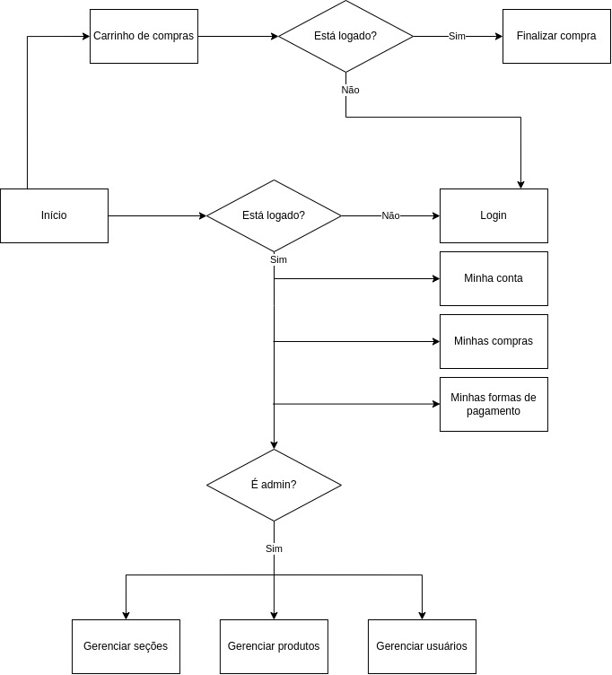

# Supermercado Feliz
Trabalho da disciplina de Introdução ao desenvolvimento web (2022)

# Autores
Lucas Xavier Leite - 10783347

Rafael Meliani Velloso - 4165457

Vinicius Finke Raiter José - 9791052

# 1. Requisitos
 Nosso projeto é um supermercado online, em que o usuário pode escolher produtos, adicionar a seu carrinho virtual e encomendá-los.
 Existem dois tipos de usuários: cliente e administrador. O cliente é alguém que pode desfrutar dos serviços do mercado e o admin é um cliente com privilégios (pode alterar dados do site).

## 1.1. Funcionalidades implementadas
### Cliente
1. Criar conta;
2. Fazer login;
3. Fazer logout;
4. Excluir própria conta conta;
5. Buscar por produto;
6. Ver descrição de produto;
7. Adicionar produto ao carrinho;
8. Editar carrinho (remover produto, alterar sua quantidade);
9. Escolher forma de pagamento;
10. Fazer pagamento;

### Administrador
1. Funcionalidades de cliente;
2. Adicionar produto a venda;
3. Excluir produto a venda;
4. Editar produto (preço, desconto, descrição, etc.);
5. Editar site (produtos em destaque, etc.)
6. Excluir contas de clientes;

## 1.2. Diagrama de Navegação

## 1.3. Dados que serão salvos no servidor
### Cliente
1. Nome;
2. Email;
3. Senha criptografada;
4. Endereço;
5. Forma de pagamento preferida;
6. Dados de compras anteriores;

### Administrador
1. Mesmos dados de um cliente;

### Produto
1. Descrição;
2. Preço unitário;
3. Quantidade em estoque;
4. Unidade;
5. Valor de desconto;
6. Código de barras;

## 2. Organização do código
O código se encontra na pasta "src" do projeto. Dentro desta pasta está a pasta components com as seguintes pastas:
  - generic: apresenta as funcionalidades genéricas que são usadas constantemente no projeto, como botões, janelas de pop-up, etc.);
  - header: apresenta o cabeçalho da página;
  - page: apresenta um container de página vazio (Page.js) e uma página que mostra os resultados de uma busca (SearchResults.js);
  - product: contém a implementação de apresentação de um produto (a apresentação de um produto, funcionalidade de adicionar ao carrinho, sua janela de pop-up e a funcionalidade de mapear produtos em seções de acordo com características em comum);
  - serchbar: contém a implementação da barra de busca;
  - sidebar: contém a implementação da barra lateral, usada para navegar entre as categorias de produtos;
  - user-area: contém área de login/cadastro, botão de carrinho, e, se usuário estiver logado, as opções de menu que mostra compras anteriores, formas de pagamento, finalizar compra, opção de sair; 

Dentro da pasta src está a "raiz" da página (App.js), os dados dos produtos que estarão a venda (ProductsData.js) e alguns arquivos de teste.

# 3. Procedimentos de execução
## 3.1. Pré-requisitos
  - Node.js (>=16.15.1)
  - npm (>=8.5.5)

## 3.2. No terminal
- Navegue até a pasta do projeto;
- Comando: `npm install` -> Instala os pacotes necessários para o projeto;
- Comando: `npm start` -> Inicia a execução do projeto;
